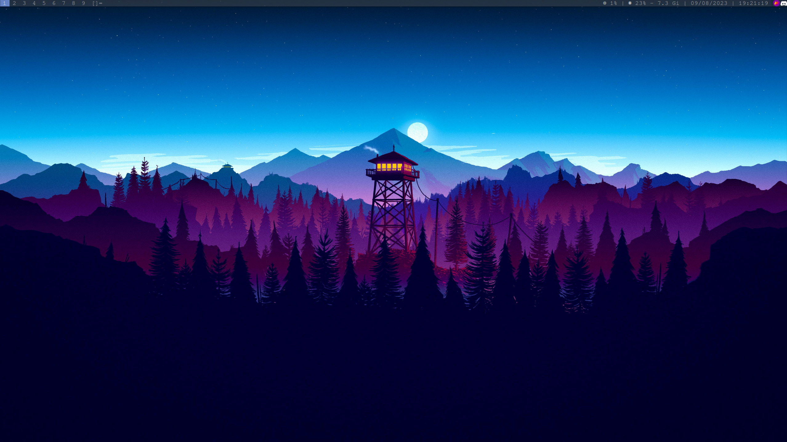
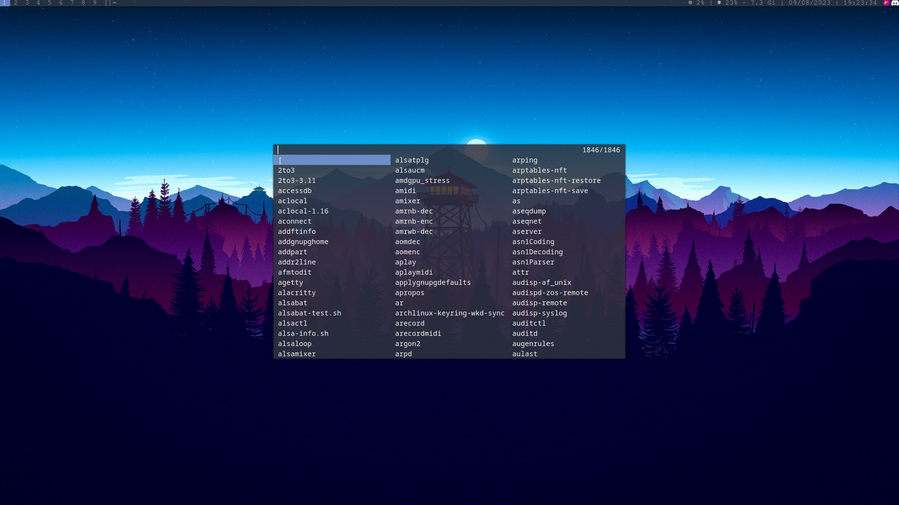

# Dotfiles




# Check out the Wiki
This repository has a [Wiki](https://github.com/Isac-AS/dotfiles/wiki) that compiles the steps done on a clean Arch Linux install to get the desktop shown as well as some problems issues found and their respective solutions.
The Wiki has the following sections:
- [0 ‐ Arch installation process](https://github.com/Isac-AS/dotfiles/wiki/0-%E2%80%90-Arch-installation-process)
- [1 - Installing dwm](https://github.com/Isac-AS/dotfiles/wiki/1-%E2%80%90-Installing-dwm)
- [2 - Configure dwm](https://github.com/Isac-AS/dotfiles/wiki/2-%E2%80%90-Configure-dwm)
- [3 - Installing Nvidia propietary drivers](https://github.com/Isac-AS/dotfiles/wiki/3-%E2%80%90-Installing-Nvidia-propietary-drivers)
- [4 - Audio and keyboard shortcuts](https://github.com/Isac-AS/dotfiles/wiki/4-%E2%80%90-Audio-and-keyboard-shortcuts)
- [5 - Theming LightDM and GRUB](https://github.com/Isac-AS/dotfiles/wiki/5-%E2%80%90-Theming-LightDM-and-GRUB)
- [6 - Fixing UEFI](https://github.com/Isac-AS/dotfiles/wiki/6-%E2%80%90-Fixing-UEFI)
- [7 - Dotfile management](https://github.com/Isac-AS/dotfiles/wiki/7-%E2%80%90-Dotfile-management)

# Dotfiles under `~/.config/`
As seen in the repo, the actual `alacritty.yml` file is under `dotfiles/alacritty/.config/alacritty/`.

After running:
```bash
stow --target=$HOME alacritty
```
This entry is created under the `~/.config/` directory:
```
lrwxrwxrwx  1 isac isac   45 MONTH  DAY HH:MM  alacritty -> ../repos/dotfiles/alacritty/.config/alacritty/
```

1. A way of visualizing the behaviour is to imagine the process of "adding an entry", in this case, the alacritty entry. This entry is the first `dotfiles/alacritty` dir.
2. Now we have to imagine that this first directory is the `target` directory, in most cases, `$HOME`.
3. Finally, the concrete config file `alacritty.yml` must be placed on a relative path from the target, `$HOME/` + `.config/alacritty/alacritty.yml`.

# Dotfiles directly on the home directory
For files like `.xprofile`, `.bashrc`, `.fehbg` or `.xbindkeysrc`, that are directly on the home directory are easier to stow. Simply put them under a directory, the name does not matter. 
In this case, as there are a lot of files that start with 'x', I decided to name it `dotfiles/X`.
These files can be directly "stowed" running:
```bash
stow --target=$HOME X
```

This way, modifications to the files themselves will be reflected on their real location, making it very easy to keep track of them.
